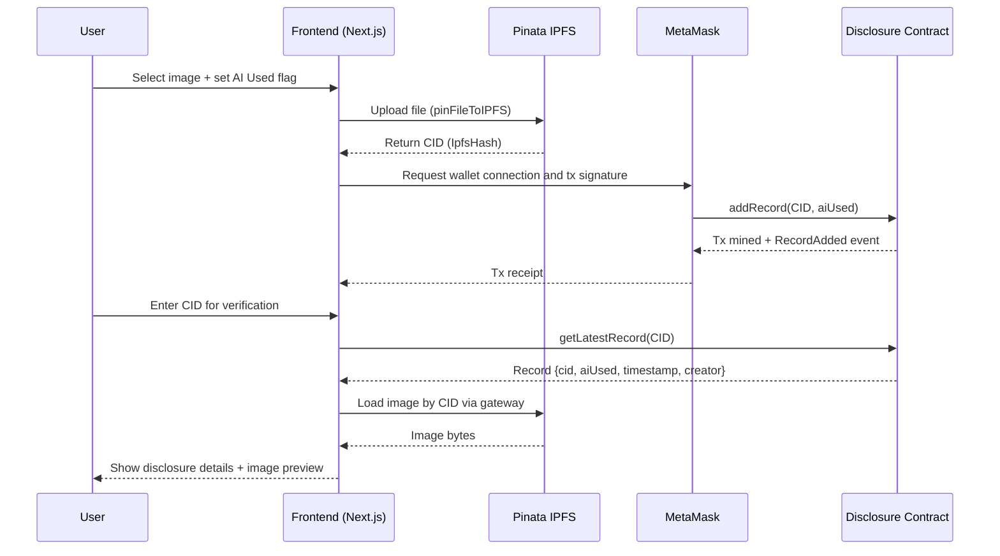

# AI Disclosure: IPFS + Blockchain Mini Project

This mini project lets a user:

- Upload an image to IPFS (via Pinata).
- Declare whether the image is AI-generated or original.
- Store that disclosure on-chain in a Solidity smart contract.
- Verify any uploaded image later by CID.

The blockchain stores metadata (CID, AI flag, timestamp, creator wallet), not raw image bytes.

## Project Structure

- `blockchain/`: Hardhat project with the smart contract and deployment script.
- `frontend/`: Next.js app for upload and verification.
- `frontend/utils/contract.js`: Ethers contract connection + ABI + contract address.
- `frontend/utils/pinata.js`: Pinata upload helper.

## How It Works

1. User selects an image in the frontend.
2. Frontend uploads the file to Pinata IPFS and receives a CID.
3. User checks or unchecks `AI Used`.
4. Frontend calls `addRecord(cid, aiUsed)` on the `Disclosure` smart contract.
5. For verification, a user enters a CID and frontend calls `getLatestRecord(cid)`.
6. Frontend shows the AI flag, creator wallet address, and image preview from Pinata gateway.

## End-to-End Sequence



## Smart Contract Behavior

Contract file: `blockchain/contracts/Disclosure.sol`

Stored fields per record:

- `cid`: IPFS CID string.
- `aiUsed`: `true` if AI-generated, `false` if original.
- `timestamp`: block timestamp of disclosure.
- `creator`: wallet address that submitted the record.

Main functions:

- `addRecord(string _hash, bool _aiUsed)`: stores a new disclosure.
- `getLatestRecord(string _hash)`: returns latest disclosure for CID/hash.
- `getAllRecords(string _hash)`: returns full history for CID/hash.
- `getTotalRecords()`: total number of records in contract.

Integrity checks built in:

- Rejects empty CID/hash.
- Prevents duplicate submission of same CID by the same wallet using `hasSubmitted`.

### Contract API Reference

| Function | Type | Inputs | Returns | Purpose |
|---|---|---|---|---|
| `addRecord` | write | `string _hash`, `bool _aiUsed` | none | Stores a new disclosure record for a CID/hash. |
| `getLatestRecord` | read | `string _hash` | `Record` | Gets the latest disclosure for a CID/hash. |
| `getAllRecords` | read | `string _hash` | `Record[]` | Gets full history for a CID/hash. |
| `getTotalRecords` | read | none | `uint256` | Gets total records stored in contract. |
| `hasSubmitted` | read (public mapping) | `string`, `address` | `bool` | Checks if a wallet already submitted the same CID/hash. |

`Record` fields:

- `cid` (`string`)
- `aiUsed` (`bool`)
- `timestamp` (`uint256`)
- `creator` (`address`)

### Event Reference

| Event | Params | Description |
|---|---|---|
| `RecordAdded` | `contentHash`, `aiUsed`, `creator`, `timestamp` | Emitted after successful `addRecord` call. |

## Prerequisites

Install before running:

- Node.js 18+ (Node.js 20+ recommended)
- npm
- MetaMask browser extension
- Pinata account + API credentials

## 1) Start Blockchain (Local Hardhat)

Open terminal in `blockchain/`:

```bash
npm install
npx hardhat node
```

Keep this terminal running.

In a new terminal (still in `blockchain/`), deploy contract:

```bash
npx hardhat run scripts/deploy.js --network localhost
```

Copy the deployed address from terminal output.

## 2) Configure Frontend

Open `frontend/utils/contract.js` and set `CONTRACT_ADDRESS` to your deployed address.

Create or update `frontend/.env.local`:

```env
NEXT_PUBLIC_PINATA_API_KEY=your_pinata_api_key
NEXT_PUBLIC_PINATA_SECRET_KEY=your_pinata_secret_key
```

Then install and run frontend in `frontend/`:

```bash
npm install
npm run dev
```

Open http://localhost:3000.

## 3) MetaMask Setup (Localhost Network)

1. Add network:
   - Network Name: Hardhat Local
   - RPC URL: http://127.0.0.1:8545
   - Chain ID: 31337
   - Currency Symbol: ETH
2. Import one test account private key shown in `npx hardhat node` output.
3. Connect MetaMask to `http://localhost:3000`.

## 4) Upload + Store Disclosure (New User Flow)

1. Choose an image using file input.
2. Check `AI Used` if the image used AI; leave unchecked if original.
3. Click `Upload + Store`.
4. Approve MetaMask transaction.
5. After confirmation:
   - Image is pinned on IPFS.
   - CID + disclosure metadata are stored on-chain.
6. Keep the CID for future verification.

## 5) Verify an Image

1. In the `Verify` section, paste CID.
2. Click `Verify`.
3. App reads on-chain record and shows:
   - AI Used: Yes/No
   - Creator: wallet address
   - Image preview from `https://gateway.pinata.cloud/ipfs/<cid>`

If no record exists for a CID, contract call reverts with `No record found`.

## Optional: Verify Directly From Hardhat Console

From `blockchain/`:

```bash
npx hardhat console --network localhost
```

Example calls:

```javascript
const address = "<your_deployed_contract_address>";
const disclosure = await ethers.getContractAt("Disclosure", address);
await disclosure.getLatestRecord("<cid>");
await disclosure.getAllRecords("<cid>");
```

## Troubleshooting

- MetaMask popup does not appear:
  - Ensure MetaMask is unlocked and connected to localhost 31337.
- Transaction fails with `Already submitted`:
  - Same wallet already submitted that CID before.
- Verification fails:
  - Ensure CID was actually stored on-chain and app points to correct contract address.
- Wrong contract data in frontend:
  - Redeploying can change contract address. Update `frontend/utils/contract.js`.

## Security Notes

Current frontend uploads directly from browser using Pinata keys in public environment variables. This is acceptable for local/demo usage, but unsafe for production.

For production:

- Move Pinata upload to a backend API route/server.
- Keep secret keys server-side only.
- Rotate any exposed Pinata keys immediately.

## Folder Docs

- Blockchain setup details: `blockchain/README.md`
- Frontend setup details: `frontend/README.md`

## Future Improvements

- Add explicit `Connect Wallet` button with better error handling.
- Auto-sync deployed contract address to frontend after deployment.
- Add record history UI using `getAllRecords`.
- Add tests for contract and frontend integration.